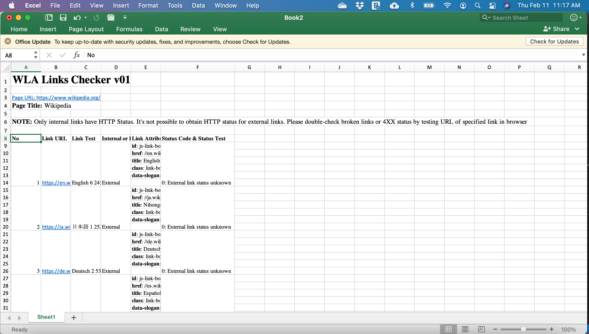

# WLA bookmarklets for simple SEO online audit and web scraping

## What are bookmarklets?

[Bookmarklets](https://support.mozilla.org/en-US/kb/bookmarklets-perform-common-web-page-tasks) are one-click tools that can be saved as regular bookmarks but, at the same time, execute JavaScript codes to perform some tasks. While learning JavaScript, I discovered that I can create useful mini-tools through bookmarklets and I'm sharing them here. 

## General instructions for bookmark installation

1. Go to boomkark manager by typing in URL 
```
chrome://bookmarks/
``` 
2. Right click and select Add new bookmark 
3. Use below title as bookmark name e.g. WLA Links Checker bookmarklet
4. Copy and paste the code below and paste in the URL portion of the bookmark
5. Save the bookmark

## General instructions for use

1. Go to the desired page for audit. For example, 
```
https://www.wikipedia.org
```
2. Click the bookmarklet and see results on a separate tab.


## Bookmarklet List

Here are some of the JavaScript codes that I've created. 
* [WLA Links Checker](WLALinksChecker.md) - Lists down all links in page and displays their link text, attributes and  HTTP status only for internal links
* [WLA Image Checker](WLAImagesChecker.md) - Lists down all images in page and displays images path with corresponding image, width and height dimensions of images and image attributes
* [WLA Basic Page Info Checker](WLABasicPageInfoChecker.md) - Displays basic page information like H1 to H6, Meta tags and HTTP Response Header (without needing to use Chrome's developer tool for this)
* [WLA Tealium Checker Checker](WLATealiumChecker.md) - Displays relevant Tealium object value-pairs in user-friendly format for purpose of auditing page load Tealium values 

## Copy and Pasting from table to Excel

One advantage of table in a page is that when one copies and paste them to pages, they are instantaneously converted to appropriate cells in Excel (or spreadsheet table). One can then select all (via ctrl-A), copy and paste from some output of these bookmarklets to Excel as shown in screenshots below.


      
<p align=center>Image of copied page</p>



<p align=center>Image of pasted table in Excel</p>


## Note

If you like the tool, please spread the news and tell others of this [link](https://github.com/washingtonalto/bookmarklets). As an open-source tool (see [license](LICENSE)), there is no warranty for this. 