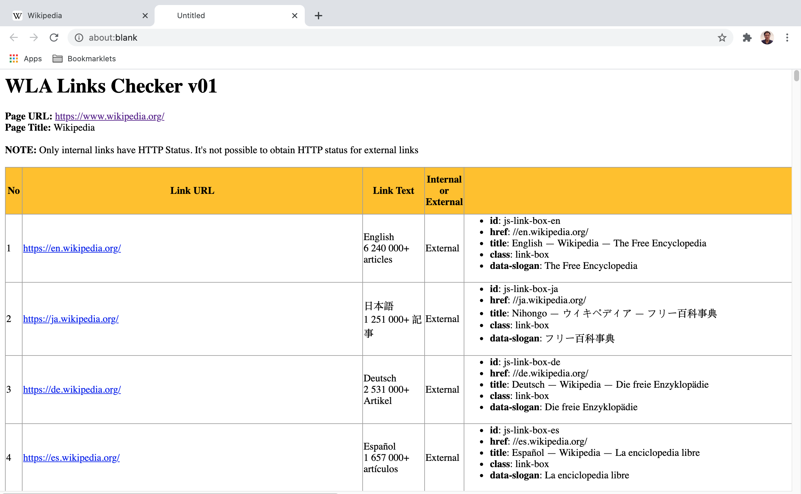

# WLA bookmarklets for simple HTML online audit

## General instructions for bookmark installation

1. Go to boomkark manager by typing in URL 
```
chrome://bookmarks/
``` 
2. Right click and select Add new bookmark 
3. Use below title as bookmark name e.g. WLA Links Checker bookmarklet
4. Copy and paste the code below and paste in the URL portion of the bookmark
5. Save the bookmark

## General instructions for use

1. Go to the desired page for audit. For example, 
```
https://www.wikipedia.org
```
2. Click the bookmarklet and see results on a separate tab.


## Code

### WLA Links Checker bookmarklet

  * Usage 

  To list down the links on the page and to check the HTTP status for internal links (it's not possible to check external links HTTP status using JavaScript).
    
  * Code  

  ```
  javascript:function listAttributes(arr){let strOutput="<DIV>";strOutput+="<UL>";for(let i=0;i<arr.length;i++)strOutput+="<LI><SPAN class='propertyname'>"+arr[i].name+"</SPAN>: "+arr[i].value+"</LI>";return strOutput+="</UL></DIV>",strOutput}function returnHTTPStatus(url,strInternalExternal){let xmlHttp=new XMLHttpRequest,statusCode="",statusText="";if(xmlHttp.open("HEAD",url,!1),"Internal"==strInternalExternal){try{xmlHttp.send()}catch(e){console.log("Error: "+e)}xmlHttp.onload=function(){statusText=xmlHttp.statusText,statusCode=xmlHttp.status},xmlHttp.onload()}else statusText="External link status unknown",statusCode="0";return statusCode+": "+statusText}function checkInternalExternalLink(linkHost,pageHost){let strOutput;return strOutput=linkHost==pageHost?"Internal":"External",strOutput}function isValidHttpUrl(strTest){let url;try{url=new URL(strTest)}catch(_){return!1}return"http:"===url.protocol||"https:"===url.protocol}function formatHTMLcellvalues(strCellinput){let strOutput;return strOutput=isValidHttpUrl(strCellinput)?"<A HREF='"+strCellinput+"' target='_blank'>"+decodeURIComponent(strCellinput)+"</A>":"object"==typeof strCellinput?listAttributes(strCellinput):null==strCellinput||0==String(strCellinput).trim().length?"":String(strCellinput).trim(),strOutput}function setTableStyle(){let strOutput="<STYLE>";return strOutput+="table,th,td { border:1px solid #9E9E9E; border-collapse: collapse  }",strOutput+="th { background: #FFC107; }",strOutput+=".propertyname { font-weight:bold; font-color:blue; }",strOutput+="</STYLE>",strOutput}function formatPageHeaders(strHeader,strNotes=""){let strOutput="<H1>"+strHeader+"</H1>";return strOutput+="<STRONG>Page URL: </STRONG>",strOutput+="<A href='"+location.href+"' target='_blank'>"+location.href+"</A><BR>",strOutput+="<STRONG>Page Title: </STRONG>",strOutput+=document.title+"<BR><BR>",strOutput+=""!=strNotes?"<STRONG>NOTE: </STRONG>"+strNotes+"<BR><BR>":"",strOutput}function formatHTMLTableHeaders(){let strOutput="<TABLE>";strOutput+="<TR>";for(let i=0;i<arguments.length;i++)strOutput+="<TH>"+arguments[i]+"</TH>";return strOutput+="</TR>",strOutput}function formatHTMLTableRows(){let strOutput="<TR>";for(let i=0;i<arguments.length;i++)strOutput+="<TD>"+formatHTMLcellvalues(arguments[i])+"</TD>";return strOutput+="</TR>",strOutput}!function(){alert("WARNING: the process might take minutes. Please click ok button and wait for tab with link information to open!");let pageH1="WLA Links Checker v01",pageNotes="Only internal links have HTTP Status. It's not possible to obtain HTTP status for external links",objCollection=document.links,pageHost=location.host,strHTMLlines="";strHTMLlines+=setTableStyle(),strHTMLlines+=formatPageHeaders(pageH1,pageNotes),strHTMLlines+=formatHTMLTableHeaders("No","Link URL","Link Text","Internal or External","Link Attributes","Status Code & Status Text");for(let i=0;i<objCollection.length;i++){let objItem=objCollection[i],objInternalExternalLink=checkInternalExternalLink(objItem.host,pageHost);strHTMLlines+=formatHTMLTableRows(i+1,objItem.href,objItem.innerText,objInternalExternalLink,objItem.attributes,returnHTTPStatus(objItem.href,objInternalExternalLink))}strHTMLlines+="</TABLE>",strHTMLlines+="<BR><BR><DIV style='text-align: center;'><CITE>Coded by Washington Alto</CITE></DIV>";let myWin=window.open();myWin.document.writeln(strHTMLlines),myWin.document.close()}();
  ```
  * Screenshot  

  
  
  <p align=center>Image of Wikipedia page</p>

  

  <p align=center>Image of Wikipedia WLA Link Checker result</p>

### WLA Images Checker bookmarklet

  * Usage 

  To list down the images on the page, display them if possible and get their width and heigtht as well as their available attributes.
    
  * Code  

  ```
  javascript:function listAttributes(arr){let strOutput="<DIV>";strOutput+="<UL>";for(let i=0;i<arr.length;i++)strOutput+="<LI><SPAN class='propertyname'>"+arr[i].name+"</SPAN>: "+arr[i].value+"</LI>";return strOutput+="</UL></DIV>",strOutput}function isValidHttpUrl(strTest){let url;try{url=new URL(strTest)}catch(_){return!1}return"http:"===url.protocol||"https:"===url.protocol}function isValidImage(strTest){let re;return new RegExp("(?:.svg|.jpg|.jpeg|.gif|.png)$").test(strTest)}function formatHTMLcellvalues(strCellinput){let strOutput;return strOutput=isValidHttpUrl(strCellinput)&&isValidImage(strCellinput)?"<A HREF='"+strCellinput+"' target='blank'>"+strCellinput+"</A><BR>":"object"==typeof strCellinput?listAttributes(strCellinput):null==strCellinput||0==String(strCellinput).trim().length?"":String(strCellinput).trim(),strOutput}function setTableStyle(){let strOutput="<STYLE>";return strOutput+="table,th,td { border:1px solid #9E9E9E; border-collapse: collapse  }",strOutput+="th { background: #FFC107; }",strOutput+="img { height:100px; max-width:90% }",strOutput+=".propertyname { font-weight:bold; font-color:blue; }",strOutput+="</STYLE>",strOutput}function formatPageHeaders(strHeader,strNotes=""){let strOutput="<H1>"+strHeader+"</H1>";return strOutput+="<STRONG>Page URL: </STRONG>",strOutput+="<A href='"+location.href+"' target='_blank'>"+location.href+"</A><BR>",strOutput+="<STRONG>Page Title: </STRONG>",strOutput+=document.title+"<BR><BR>",strOutput+=""!=strNotes?"<STRONG>NOTE: </STRONG>"+strNotes+"<BR><BR>":"",strOutput}function formatHTMLTableHeaders(){let strOutput="<TABLE>";strOutput+="<TR>";for(let i=0;i<arguments.length;i++)strOutput+="<TH>"+arguments[i]+"</TH>";return strOutput+="</TR>",strOutput}function formatHTMLTableRows(){let strOutput="<TR>";for(let i=0;i<arguments.length;i++)strOutput+="<TD>"+formatHTMLcellvalues(arguments[i])+"</TD>";return strOutput+="</TR>",strOutput}!function(){let pageH1="WLA Images Checker v01",pageNotes="",objCollection=document.images,pageHost=location.host,strHTMLlines="";strHTMLlines+=setTableStyle(),strHTMLlines+=formatPageHeaders(pageH1,""),strHTMLlines+=formatHTMLTableHeaders("No","Image URL","Image Height","Image Width","Image Alt Text","Image Attributes");for(let i=0;i<objCollection.length;i++){let objItem=objCollection[i];strHTMLlines+=formatHTMLTableRows(i+1,objItem.src,objItem.height,objItem.width,objItem.alt,objItem.attributes)}strHTMLlines+="</TABLE>",strHTMLlines+="<BR><BR><DIV style='text-align: center;'><CITE>Coded by Washington Alto</CITE></DIV>";let myWin=window.open();myWin.document.writeln(strHTMLlines),myWin.document.close()}();
  ```
  
### WLA Basic Page Info Checker bookmarklet

  * Usage 

  To list down basic information on the page such as H1 to H6, Meta Descriptions, etc. that can be useful for basic SEO audit on the page
    
  * Code  

  ```
  javascript:function returnHTTPAllResponseHeaders(url){let strOutput,xmlHttp=new XMLHttpRequest;xmlHttp.open("HEAD",url,!1);try{xmlHttp.send()}catch(e){console.log("Error: "+e)}return xmlHttp.onload=function(){strOutput=xmlHttp.getAllResponseHeaders()},xmlHttp.onload(),strOutput}function isValidHttpUrl(strTest){let url;try{url=new URL(strTest)}catch(_){return!1}return"http:"===url.protocol||"https:"===url.protocol}function formatHTMLcellvalues(strCellinput){let strOutput;return strOutput=isValidHttpUrl(strCellinput)?"<A HREF='"+strCellinput+"' target='_blank'>"+decodeURIComponent(strCellinput)+"</A>":null==strCellinput||0==String(strCellinput).trim().length?"":String(strCellinput).trim(),strOutput}function setTableStyle(){let strOutput="<STYLE>";return strOutput+="table,th,td { border:1px solid #9E9E9E; border-collapse: collapse  }",strOutput+="th { background: #FFC107; }",strOutput+="</STYLE>",strOutput}function formatPageHeaders(strHeader,strNotes=""){let strOutput="<H1>"+strHeader+"</H1>";return strOutput+="<STRONG>Page URL: </STRONG>",strOutput+="<A href='"+location.href+"' target='_blank'>"+location.href+"</A><BR>",strOutput+="<STRONG>Page Title: </STRONG>",strOutput+=document.title+"<BR>",strOutput+="<STRONG>Page Title Length: </STRONG>",strOutput+=document.title.trim().length+"<BR><BR>",strOutput+=""!=strNotes?"<STRONG>NOTE: </STRONG>"+strNotes+"<BR><BR>":"",strOutput}function formatHTMLTableHeaders(){let strOutput="<TABLE>";strOutput+="<TR>";for(let i=0;i<arguments.length;i++)strOutput+="<TH>"+arguments[i]+"</TH>";return strOutput+="</TR>",strOutput}function formatHTMLTableRows(){let strOutput="<TR>";for(let i=0;i<arguments.length;i++)strOutput+="<TD>"+formatHTMLcellvalues(arguments[i])+"</TD>";return strOutput+="</TR>",strOutput}function getallH1toH6(){let arrallH=new Array,arrH1=Array.from(document.getElementsByTagName("H1")),arrH2=Array.from(document.getElementsByTagName("H2")),arrH3=Array.from(document.getElementsByTagName("H3")),arrH4=Array.from(document.getElementsByTagName("H4")),arrH5=Array.from(document.getElementsByTagName("H5")),arrH6=Array.from(document.getElementsByTagName("H6"));return arrallH=arrH1.concat(arrH2).concat(arrH3).concat(arrH4).concat(arrH5).concat(arrH6),arrallH}!function(){let pageH1="WLA Basic Page Info Checker v01",pageNotes="",objCollection="",pageHost=location.host,strHTMLlines="",responsetext;strHTMLlines+=setTableStyle(),strHTMLlines+=formatPageHeaders(pageH1,""),objCollection=getallH1toH6(),strHTMLlines+="<H1>H1 to H6 Tag</H1>",strHTMLlines+=formatHTMLTableHeaders("No","H1 to H6 Tag","H1 to H6 Tag Text","H1 to H6 Tag Text Length");for(let i=0;i<objCollection.length;i++){let objItem=objCollection[i];strHTMLlines+=formatHTMLTableRows(i+1,objItem.tagName,objItem.innerText.trim(),objItem.innerText.trim().length)}strHTMLlines+="</TABLE>",objCollection=document.querySelectorAll("meta[name]"),strHTMLlines+="<H1>Meta Name Tag</H1>",strHTMLlines+=formatHTMLTableHeaders("No","Name","Content","Content Length");for(let i=0;i<objCollection.length;i++){let objItem=objCollection[i];objItem&&null!=objItem.attributes.name&&null!=objItem.attributes.content&&(strHTMLlines+=formatHTMLTableRows(i+1,objItem.attributes.name.value,objItem.attributes.content.value,String(objItem.attributes.content.value).trim().length))}strHTMLlines+="</TABLE>",objCollection=returnHTTPAllResponseHeaders(location.href).split("\n"),objCollection.pop(),strHTMLlines+="<H1>HTTP Response Headers Information</H1>",strHTMLlines+=formatHTMLTableHeaders("No","Item-Pair");for(let i=0;i<objCollection.length;i++){let objItem;strHTMLlines+=formatHTMLTableRows(i+1,objCollection[i])}strHTMLlines+="</TABLE>",strHTMLlines+="<BR><BR><DIV style='text-align: center;'><CITE>Coded by Washington Alto</CITE></DIV>";let myWin=window.open();myWin.document.writeln(strHTMLlines),myWin.document.close()}();
  ```
  
### WLA Tealium Checker bookmarklet

  * Usage 

  To list down some Tealium UDO variable values as well as information from relevant Tealium objects. Note that this will only work on pages that uses Tealium. 
    
  * Code  

  ```
  javascript:function setPageStyle(){let strOutput="<STYLE>";return strOutput+=".propertyname { font-weight:bold; font-color:blue; }.outputarea { background-color: lightblue; } ",strOutput+="</STYLE>",strOutput}function formatPageHeaders(strHeader,strNotes=""){let strOutput="<H1>"+strHeader+"</H1>";return strOutput+="<STRONG>Page URL: </STRONG>",strOutput+="<A href='"+location.href+"' target='_blank'>"+location.href+"</A><BR>",strOutput+="<STRONG>Page Title: </STRONG>",strOutput+=document.title+"<BR><BR>",strOutput+=""!=strNotes?"<STRONG>NOTE: </STRONG>"+strNotes+"<BR><BR>":"",strOutput}function recursiveObjformat(obj){let strOutput="<DIV class='outputarea'>";strOutput+="<UL>";for(let property in obj)if(obj.hasOwnProperty(property)&&null==obj[property])strOutput+="<LI><SPAN class='propertyname'>"+property+"</SPAN>: (null)</LI>";else if(!obj.hasOwnProperty(property)||obj[property].constructor!=String&&obj[property].constructor!=Number&&obj[property].constructor!=Boolean)if(obj.hasOwnProperty(property)&&obj[property].constructor==Array){strOutput+="<LI><SPAN class='propertyname'>"+property+"</SPAN>: <OL>";for(let i=0;i<obj[property].length;i++)strOutput+="<LI>"+obj[property][i]+"</LI>";strOutput+="</OL></LI>"}else obj.hasOwnProperty(property)&&obj[property].constructor==Object?(strOutput+="<LI><SPAN class='propertyname'>"+property+"</SPAN>: ",strOutput+=recursiveObjformat(obj[property]),strOutput+="</LI>"):obj.hasOwnProperty(property)&&obj[property].constructor==Function&&(strOutput+="<LI><SPAN class='propertyname'>"+property+"</SPAN>: ",strOutput+=obj[property],strOutput+="</LI>");else strOutput+="<LI><SPAN class='propertyname'>"+property+"</SPAN>: "+obj[property]+"</LI>";return strOutput+="</UL></DIV><BR>",strOutput}!function(){let pageH1="WLA Tealium Checker v01",pageNotes="",pageHost=location.host,strHTMLlines="";strHTMLlines+=setPageStyle(),strHTMLlines+=formatPageHeaders(pageH1,""),strHTMLlines+="<H2>utag.data</H2>",strHTMLlines+=recursiveObjformat(utag.data),strHTMLlines+="<H2>utag.rpt</H2>",strHTMLlines+=recursiveObjformat(utag.rpt),strHTMLlines+="<H2>utag.cfg</H2>",strHTMLlines+=recursiveObjformat(utag.cfg),strHTMLlines+="<H2>utag.send</H2>",strHTMLlines+=recursiveObjformat(utag.send),strHTMLlines+="<H2>utag.sender</H2>",strHTMLlines+=recursiveObjformat(utag.sender),strHTMLlines+="<BR><BR><DIV style='text-align: center;'><CITE>Coded by Washington Alto</CITE></DIV>";let myWin=window.open();myWin.document.writeln(strHTMLlines),myWin.document.close()}();
  ```
  
