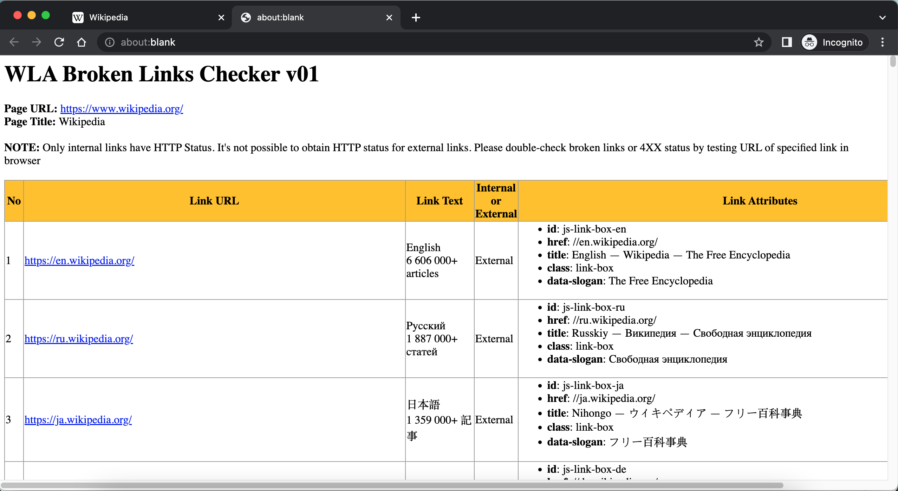

### WLA Broken Links Checker bookmarklet

  * Usage 

    To list down the links on the page and to check the HTTP status for internal links if there's broken links (it's not possible to check external links HTTP status using JavaScript). Be sure to double-check links with 4XX status by testing it in browser as links to downloads like pdfs may return 4XX when it's not. 
    
  * Code  

    ```
    javascript: function listAttributes(arr){let strOutput="<DIV>";strOutput+="<UL>";for(let i=0;i<arr.length;i++)strOutput+="<LI><SPAN class='propertyname'>"+arr[i].name+"</SPAN>: "+arr[i].value+"</LI>";return strOutput+="</UL></DIV>",strOutput}function returnHTTPStatus(urlDict){statusCodeDict={100:"Continue",101:"Switching Protocols",102:"Processing (WebDAV)",103:"Early Hints Experimental",200:"OK",201:"Created",202:"Accepted",203:"Non-Authoritative Information",204:"No Content",205:"Reset Content",206:"Partial Content",207:"Multi-Status (WebDAV)",208:"Already Reported (WebDAV)",226:"IM Used (HTTP Delta encoding)",300:"Multiple Choices",301:"Moved Permanently",302:"Found",303:"See Other",304:"Not Modified",305:"Use Proxy Deprecated",306:"unused",307:"Temporary Redirect",308:"Permanent Redirect",400:"Bad Request",401:"Unauthorized",402:"Payment Required Experimental",403:"Forbidden",404:"Not Found",405:"Method Not Allowed",406:"Not Acceptable",407:"Proxy Authentication Required",408:"Request Timeout",409:"Conflict",410:"Gone",411:"Length Required",412:"Precondition Failed",413:"Payload Too Large",414:"URI Too Long",415:"Unsupported Media Type",416:"Range Not Satisfiable",417:"Expectation Failed",421:"Misdirected Request",422:"Unprocessable Entity (WebDAV)",423:"Locked (WebDAV)",424:"Failed Dependency (WebDAV)",425:"Too Early Experimental",426:"Upgrade Required",428:"Precondition Required",429:"Too Many Requests",431:"Request Header Fields Too Large",451:"Unavailable For Legal Reasons",500:"Internal Server Error",501:"Not Implemented",502:"Bad Gateway",503:"Service Unavailable",504:"Gateway Timeout",505:"HTTP Version Not Supported",506:"Variant Also Negotiates",507:"Insufficient Storage (WebDAV)",508:"Loop Detected (WebDAV)",510:"Not Extended",511:"Network Authentication Required"},url=String(urlDict.internalLink),linkText=String(urlDict.internalLinkText);let xmlHttp=new XMLHttpRequest,statusCode=0;xmlHttp.open("HEAD",url,!1);try{xmlHttp.send()}catch(e){console.log("Error: "+e)}return xmlHttp.onload=function(){statusCode=xmlHttp.status,statusText=statusCodeDict[String(statusCode)]},xmlHttp.onload(),statusDesc=formatHTMLcellvalues(url)+(linkText?" ("+linkText+")":"")+" - HTTP Status: "+(200!=statusCode?"<span style='color:red'>"+statusCode+"</span>":statusCode)+(statusText?": ":"")+statusText,{statusCode:statusCode,statusDesc:statusDesc}}function checkInternalExternalLink(linkHost,pageHost){let strOutput;return strOutput=linkHost==pageHost?"Internal":"External",strOutput}function isValidHttpUrl(strTest){let url;try{url=new URL(strTest)}catch(_){return!1}return"http:"===url.protocol||"https:"===url.protocol}function formatHTMLcellvalues(strCellinput){let strOutput;return strOutput=isValidHttpUrl(strCellinput)?"<A HREF='"+strCellinput+"' target='_blank'>"+decodeURIComponent(strCellinput)+"</A>":"object"==typeof strCellinput?listAttributes(strCellinput):null==strCellinput||0==String(strCellinput).trim().length?"":String(strCellinput).trim(),strOutput}function setTableStyle(){let strOutput="<STYLE>";return strOutput+="table,th,td { border:1px solid #9E9E9E; border-collapse: collapse  }",strOutput+="th { background: #FFC107; }",strOutput+=".propertyname { font-weight:bold; font-color:blue; }",strOutput+="</STYLE>",strOutput}function formatPageHeaders(strHeader,strNotes=""){let strOutput="<H1>"+strHeader+"</H1>";return strOutput+="<STRONG>Page URL: </STRONG>",strOutput+="<A href='"+location.href+"' target='_blank'>"+location.href+"</A><BR>",strOutput+="<STRONG>Page Title: </STRONG>",strOutput+=document.title+"<BR><BR>",strOutput+=""!=strNotes?"<STRONG>NOTE: </STRONG>"+strNotes+"<BR><BR>":"",strOutput}function formatHTMLTableHeaders(){let strOutput="<TABLE>";strOutput+="<TR>";for(let i=0;i<arguments.length;i++)strOutput+="<TH>"+arguments[i]+"</TH>";return strOutput+="</TR>",strOutput}function formatHTMLTableRows(){let strOutput="<TR>";for(let i=0;i<arguments.length;i++)strOutput+="<TD>"+formatHTMLcellvalues(arguments[i])+"</TD>";return strOutput+="</TR>",strOutput}!function(){let pageH1="WLA Broken Links Checker v01",pageNotes="Only internal links have HTTP Status. It's not possible to obtain HTTP status for external links. Please double-check broken links or 4XX status by testing URL of specified link in browser ";const objCollection=document.links;let pageHost=location.host,strHTMLlines="";strHTMLlines+=setTableStyle(),strHTMLlines+=formatPageHeaders(pageH1,pageNotes),strHTMLlines+=formatHTMLTableHeaders("No","Link URL","Link Text","Internal or External","Link Attributes"),listofInternalLinks=[];for(let i=0;i<objCollection.length;i++){let objItem=objCollection[i],objInternalExternalLink=checkInternalExternalLink(objItem.host,pageHost);strHTMLlines+=formatHTMLTableRows(i+1,objItem.href,objItem.innerText,objInternalExternalLink,objItem.attributes),"Internal"==objInternalExternalLink&&listofInternalLinks.push({internalLink:objItem.href,internalLinkText:objItem.innerText})}strHTMLlines+="</TABLE>",numBrokenLinks=0,numLinks=0,strHTMLlines+="<BR><BR>Internal Links and corresponding HTTP Status<BR>",strHTMLlines+="<OL>",listofInternalLinks.sort();for(let i=0;i<listofInternalLinks.length;i++){let internalLinks=listofInternalLinks[i];statusDesc=returnHTTPStatus(internalLinks).statusDesc,statusCode=returnHTTPStatus(internalLinks).statusCode,strHTMLlines+="<LI>"+statusDesc+"</LI>",200!=statusCode&&(numBrokenLinks+=1),numLinks+=1}strHTMLlines+="</OL>",strHTMLlines+="<BR>The number of broken links (internal) is "+numBrokenLinks+" out of "+numLinks+" internal links.",strHTMLlines+="<BR><BR><DIV style='text-align: center;'><CITE>Copyright: (c) 2021, Washington Alto</CITE></DIV>";let myWin=window.open();myWin.document.writeln(strHTMLlines),myWin.document.close()}();
    ```
  * Screenshot  

    
      
    <p align=center>Image of Wikipedia page</p>

    

    <p align=center>Image of Wikipedia WLA Link Checker result</p>
