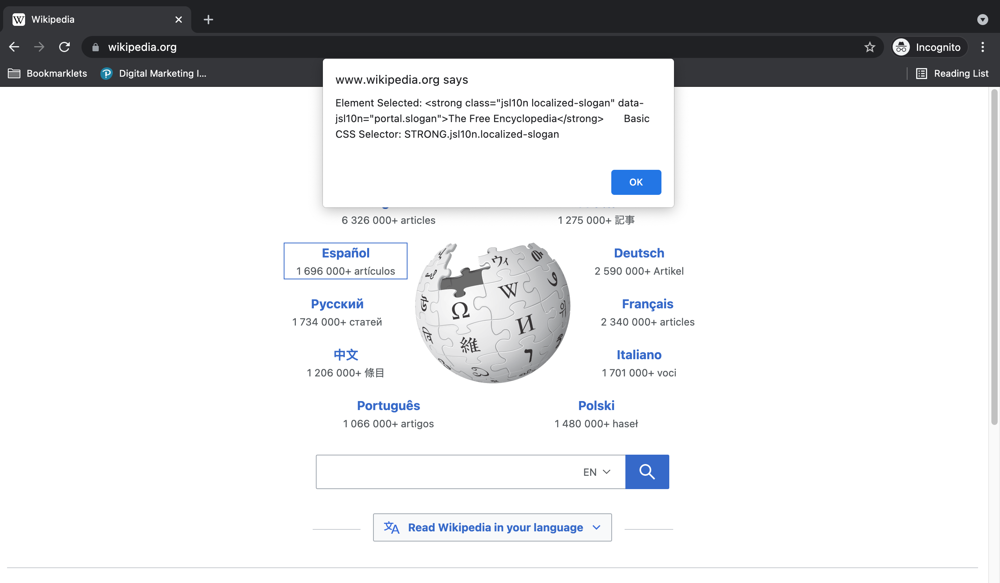

### WLA CSS Selector Web Scraper bookmarklet

  * Usage 

    This bookmarklet will add an EventListener that will allow one to select an HTML Element by right-clicking on it and obtaining the CSS Selector. The bookmarklet will disappear once the page is refreshed.
    
  * Code  

    ```
    javascript:alert("WLA CSS Selector Tool - This is a simple CSS selector tool. To use, right click on the element of interest. This code will be removed once page is refreshed. Copyright: (c) 2021, Washington Alto");const selectEventHandler=e=>{e.preventDefault();const targetElement=e.target;let modal_body_text="Element Selected: "+targetElement.outerHTML+"       Basic CSS Selector: "+targetElement.nodeName+(targetElement.id?"#"+targetElement.id:"."+(targetElement.className?String(targetElement.className).replaceAll(" ","."):""));alert(modal_body_text)},bodyElement=document.querySelector("body");bodyElement.addEventListener("contextmenu",selectEventHandler);
  * Screenshot  

    
      
    <p align=center>Image of Wikipedia page</p>

    

    <p align=center>Image of Wikipedia WLA CSS Selector Tool Selection</p>
