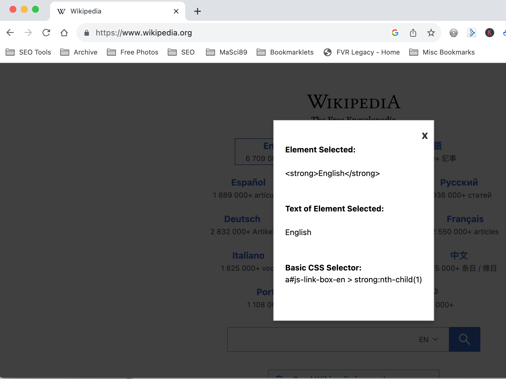

### WLA CSS Selector ver 2 Web Scraper bookmarklet

  * Usage 

    This bookmarklet will add an EventListener that will allow one to select an HTML Element by right-clicking on it and obtaining the CSS Selector. The bookmarklet will disappear once the page is refreshed. This is the improved version (ver 2)
    
  * Code  

    ```
    javascript:function encode_HTML(e){return e.replace(/\>/g,"&gt;").replace(/\</g,"&lt;")}function getLongCssSelector(e){if(!(e instanceof Element))return;const t=[];for(;e.parentElement;){let o=e.tagName.toLowerCase();if(e.id){o+=`#${e.id}`,t.unshift(o);break}{let t=Array.from(e.parentElement.children).indexOf(e)+1;o+=`:nth-child(${t})`}t.unshift(o),e=e.parentElement}return t.join(" > ")}function getCssSelectorWithIdOrClass(e){if(!(e instanceof Element))return;const t=e.id;if(t)return`#${t}`;const o=Array.from(e.classList).join(".");return o?`.${o}`:null}function getCssSelector(e){return getCssSelectorWithIdOrClass(e)&&null!=getCssSelectorWithIdOrClass(e)?getCssSelectorWithIdOrClass(e):getLongCssSelector(e)}alert("WLA CSS Selector Tool ver 2 - This is a simple CSS selector tool. To use, right click on the element of interest. This code will be removed once page is refreshed. Copyright: (c) 2023, Washington Alto");class Popup{constructor(){this.createOverlay(),this.createPopup()}createOverlay(){this.overlay=document.createElement("div"),this.overlay.id="CSS-special-overlay",this.overlay.style.position="fixed",this.overlay.style.top="0",this.overlay.style.left="0",this.overlay.style.width="100%",this.overlay.style.height="100%",this.overlay.style.backgroundColor="rgba(0, 0, 0, 0.75)",this.overlay.style.zIndex="9998",this.overlay.style.display="none",this.overlay.style.cursor="not-allowed",this.overlay.style.pointerEvents="none",document.body.appendChild(this.overlay)}createPopup(){this.popup=document.createElement("div"),this.popup.id="custom-popup",this.popup.style.position="fixed",this.popup.style.top="50%",this.popup.style.left="50%",this.popup.style.transform="translate(-50%, -50%)",this.popup.style.background="white",this.popup.style.border="1px solid #ccc",this.popup.style.padding="20px",this.popup.style.boxShadow="0px 4px 8px rgba(0, 0, 0, 0.2)",this.popup.style.zIndex="9999",this.popup.style.overflow="auto",this.closeIcon=document.createElement("div"),this.closeIcon.id="close-icon",this.closeIcon.innerHTML="x",this.closeIcon.style.position="absolute",this.closeIcon.style.top="10px",this.closeIcon.style.right="10px",this.closeIcon.style.fontSize="20px",this.closeIcon.style.fontWeight="bold",this.closeIcon.style.color="#333",this.closeIcon.style.cursor="pointer",this.popup.appendChild(this.closeIcon),document.body.appendChild(this.popup)}displayText(e){this.popup.innerHTML+="<BR>"+e,this.popup.style.display="block",this.overlay.style.pointerEvents="none",this.overlay.style.display="block",this.popup.querySelector("#close-icon").addEventListener("click",this.closePopUp.bind(this))}closePopUp(){hasPopup=!1,this.popup.style.display="none",this.overlay.style.pointerEvents="auto",this.overlay.style.display="none",document.body.removeChild(this.popup),document.body.removeChild(this.overlay)}}const selectEventHandler=e=>{e.preventDefault();const t=e.target;let o="<STRONG>Element Selected:</STRONG><BR><BR>"+encode_HTML(t.outerHTML)+"<BR><BR><BR><STRONG>Text of Element Selected:</STRONG><BR><BR>"+t.textContent+"<BR><BR><BR><STRONG>Basic CSS Selector:</STRONG><BR>"+getCssSelector(t)+"<BR><BR><BR>";if(!hasPopup){hasPopup=!0;const e=new Popup;e.displayText(o)}};var hasPopup=!1;bodyElement=document.querySelector("body"),bodyElement.addEventListener("contextmenu",selectEventHandler);  
    ```
    
    * Screenshot  

    
      
    <p align=center>Image of Wikipedia page</p>

    

    <p align=center>Image of Wikipedia WLA CSS Selector Tool Selection</p>
