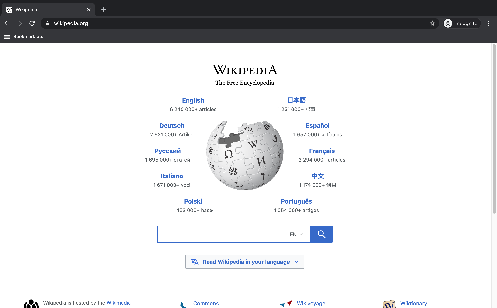

### WLA CSS Selector Web Scraper bookmarklet

  * Usage 

    To list down results of web scrape CSS selector query in tabular form. The result includes not only the extracted innerText but also the outerHTML and the attributes of the node. Not only will one be able to view the table of extracted text but one will be able to quickly download them to CSV format. 
    
  * Code  

    ```
    javascript:class ListofObj_to_Table{strHTMLlines="";tableHeader=["No."];tableData=[];tableTitle="";objCSV="";constructor(tableObjSchema,tableObj){this.tableObjSchema=tableObjSchema,this.tableObj=tableObj}static listAttributes(arr){let strOutput="<DIV>";strOutput+="<UL>";for(let i=0;i<arr.length;i++)strOutput+="<LI><SPAN class='propertyname'>"+arr[i].name+"</SPAN>: "+arr[i].value+"</LI>";return strOutput+="</UL></DIV>",strOutput}static isValidHttpUrl(strTest){let url;try{url=new URL(strTest)}catch(_){return!1}return"http:"===url.protocol||"https:"===url.protocol}static formatHTMLcellvalues(strCellinput){let tagsToReplace={"&":"&amp;","<":"&lt;",">":"&gt;"},strOutput;function replaceTag(tag){return tagsToReplace[tag]||tag}function safe_tags_replace(str){return str.replace(/[&<>]/g,replaceTag)}return strOutput=ListofObj_to_Table.isValidHttpUrl(strCellinput)?"<A HREF='"+strCellinput+"' target='_blank'>"+decodeURIComponent(strCellinput)+"</A>":"object"==typeof strCellinput?ListofObj_to_Table.listAttributes(strCellinput):null==strCellinput||0==String(strCellinput).trim().length?"":safe_tags_replace(String(strCellinput).trim()),strOutput}setTableStyle(headerBackgroundColor="#FFC107"){let strOutput="<STYLE>";return strOutput+="table,th,td { border:1px solid #9E9E9E; border-collapse: collapse  }",strOutput+="th { background: "+headerBackgroundColor+"; }",strOutput+=".propertyname { font-weight:bold; font-color:blue; }",strOutput+="</STYLE>",strOutput}setTableTitle(tableTitle=""){this.tableTitle=tableTitle}static formatHTMLTableHeaders(){let strOutput="<TABLE>";strOutput+="<TR>";for(let i=0;i<arguments.length;i++)strOutput+="<TH>"+arguments[i]+"</TH>";return strOutput+="</TR>",strOutput}static formatHTMLTableRows(){let strOutput="<TR>";for(let i=0;i<arguments.length;i++)strOutput+="<TD>"+ListofObj_to_Table.formatHTMLcellvalues(arguments[i])+"</TD>";return strOutput+="</TR>",strOutput}createHTMLTable(){let objCollection=this.tableObj;this.tableHeader=this.tableHeader.concat(Object.keys(this.tableObjSchema)),this.tableData=Object.values(this.tableObjSchema),this.collectionFields=[],this.strHTMLlines+=this.setTableStyle(),this.strHTMLlines+=this.tableTitle.length>0?"<H1>"+this.tableTitle+"</H1>":"",this.strHTMLlines+=ListofObj_to_Table.formatHTMLTableHeaders(...this.tableHeader);for(let i=0;i<objCollection.length;i++){let objItem=objCollection[i];this.tableData.forEach(item=>{this.collectionFields.push(eval(item))}),this.strHTMLlines+=ListofObj_to_Table.formatHTMLTableRows(i+1,...this.collectionFields),this.collectionFields=[]}return this.strHTMLlines+="</TABLE><BR>",this.objCSV=ListofObj_to_Table.createobjCSVTable(this),this.strHTMLlines+=ListofObj_to_Table.createCSVBloblink(this.objCSV),this.strHTMLlines}static formatCSVTableHeaders(){let strOutput="";for(let i=0;i<arguments.length;i++)i<arguments.length-1?strOutput+='"'+arguments[i]+'",':strOutput+='"'+arguments[i]+'"\n';return strOutput}static formatCSVTableRows(){let strOutput="";for(let i=0;i<arguments.length;i++)i<arguments.length-1?strOutput+=ListofObj_to_Table.escapeForCSV(ListofObj_to_Table.formatCSVcellvalues(arguments[i]))+",":strOutput+=ListofObj_to_Table.escapeForCSV(ListofObj_to_Table.formatCSVcellvalues(arguments[i]))+"\n";return strOutput}static createobjCSVTable(thisObj){let objCollection=thisObj.tableObj;thisObj.collectionFields=[];let strCSVlines="";strCSVlines+=ListofObj_to_Table.formatCSVTableHeaders(...thisObj.tableHeader);for(let i=0;i<objCollection.length;i++){let objItem=objCollection[i];thisObj.tableData.forEach(item=>{thisObj.collectionFields.push(eval(item))}),strCSVlines+=ListofObj_to_Table.formatCSVTableRows(i+1,...thisObj.collectionFields),thisObj.collectionFields=[]}return strCSVlines}static createCSVBloblink(objCSV,csvFileName="download.csv"){let linkText="Download as CSV",objCSVBlob=new Blob([objCSV],{type:"text/csv"}),csvURL,HTMLlink;return'<A href="'+window.URL.createObjectURL(objCSVBlob)+'" download="'+csvFileName+'">'+linkText+"</A>"}static escapeForCSV(inputString){return/[",\n]/.test(inputString)?'"'+inputString.replace(/"/g,'""')+'"':inputString}static formatCSVcellvalues(strCellinput){function CSVlistAttributes(arr){let strOutput="";for(let i=0;i<arr.length;i++)strOutput+=arr[i].name+": "+arr[i].value+";\n\r";return strOutput}let strOutput;return strOutput="object"==typeof strCellinput?CSVlistAttributes(strCellinput):String(strCellinput).trim(),strOutput}}class PageProperty{pageTitle="";objProperty={};constructor(objProperty,pageTitle=""){this.pageTitle=pageTitle,this.objProperty=objProperty}displayPageHeaders(){let strHeader=this.pageTitle,strOutput="<TITLE>"+strHeader+"</TITLE>";strOutput+="<H1>"+strHeader+"</H1>";for(let key in this.objProperty)strOutput+="<STRONG>"+key+"</STRONG>: ",strOutput+=PageProperty.formatObjvalues(this.objProperty[key])+"<BR>";return strOutput+="<BR>",strOutput}displayPageFooters(){let strFooter;return"<BR><BR><DIV style='text-align: center;'><CITE>Copyright: (c) 2021, Washington Alto</CITE></DIV>"}static isValidHttpUrl(strTest){let url;try{url=new URL(strTest)}catch(_){return!1}return"http:"===url.protocol||"https:"===url.protocol}static formatObjvalues(strCellinput){let tagsToReplace={"&":"&amp;","<":"&lt;",">":"&gt;"},strOutput;function replaceTag(tag){return tagsToReplace[tag]||tag}function safe_tags_replace(str){return str.replace(/[&<>]/g,replaceTag)}return strOutput=PageProperty.isValidHttpUrl(strCellinput)?"<A HREF='"+strCellinput+"' target='_blank'>"+decodeURIComponent(strCellinput)+"</A>":null==strCellinput||0==String(strCellinput).trim().length?"":safe_tags_replace(String(strCellinput).trim()),strOutput}}!function(){var cssSelectorwebscrape=prompt("Enter CSS selector for web scraping (default:A): ","A");let strHTMLlines="";propDict={"Page URL":location.href,"Page Name":document.title,"CSS Selector Used":cssSelectorwebscrape};let propPage=new PageProperty(propDict,pageTitle="WLA CSS Selector Web Scraper v02");var htmlTable;strHTMLlines+=propPage.displayPageHeaders(),listoftestObject=document.querySelectorAll(cssSelectorwebscrape),tableschema={"Extracted innerText":"objItem['innerText']","Extracted outerHTML":"objItem['outerHTML']","CSS selector attributes":"objItem['attributes']"},strHTMLlines+=new ListofObj_to_Table(tableschema,listoftestObject).createHTMLTable(),strHTMLlines+=propPage.displayPageFooters();let myWin=window.open();myWin.document.writeln(strHTMLlines),myWin.document.close()}();
    ```
  * Screenshot  

    
      
    <p align=center>Image of Wikipedia page</p>

    

    <p align=center>Image of Wikipedia WLA CSS Extractor result</p>
