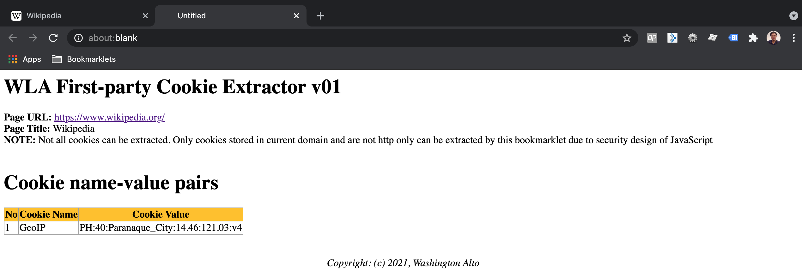

### WLA First-party Cookie Extractor bookmarklet

  * Usage 

    To list down contents of cookie using the DOM document.cookie. Note that not all cookies can be extracted. Only cookies stored in current domain and are not http only can be extracted by this bookmarklet due to security design of JavaScript   
    
  * Code  

    ```
    javascript:function isValidHttpUrl(strTest){let url;try{url=new URL(strTest)}catch(_){return!1}return"http:"===url.protocol||"https:"===url.protocol}function formatHTMLcellvalues(strCellinput){let strOutput;return strOutput=isValidHttpUrl(strCellinput)?"<A HREF='"+strCellinput+"' target='_blank'>"+decodeURIComponent(strCellinput)+"</A>":null==strCellinput||0==String(strCellinput).trim().length?"":decodeURIComponent(String(strCellinput).trim()),strOutput}function setTableStyle(){let strOutput="<STYLE>";return strOutput+="table,th,td { border:1px solid #9E9E9E; border-collapse: collapse  }",strOutput+="th { background: #FFC107; }",strOutput+="</STYLE>",strOutput}function formatPageHeaders(strHeader,strNotes=""){let strOutput="<H1>"+strHeader+"</H1>";return strOutput+="<STRONG>Page URL: </STRONG>",strOutput+="<A href='"+location.href+"' target='_blank'>"+location.href+"</A><BR>",strOutput+="<STRONG>Page Title: </STRONG>",strOutput+=document.title+"<BR>",strOutput+=""!=strNotes?"<STRONG>NOTE: </STRONG>"+strNotes+"<BR><BR>":"",strOutput}function formatHTMLTableHeaders(){let strOutput="<TABLE>";strOutput+="<TR>";for(let i=0;i<arguments.length;i++)strOutput+="<TH>"+arguments[i]+"</TH>";return strOutput+="</TR>",strOutput}function formatHTMLTableRows(){let strOutput="<TR>";for(let i=0;i<arguments.length;i++)strOutput+="<TD>"+formatHTMLcellvalues(arguments[i])+"</TD>";return strOutput+="</TR>",strOutput}function getcookieObject(){const cookies=document.cookie.split(";").reduce((cookies,cookie)=>{const[name,val]=cookie.split("=").map(c=>c.trim());return cookies[name]=decodeURIComponent(val),cookies},{});return cookies}!function(){let pageH1="WLA First-party Cookie Extractor v01",pageNotes="Not all cookies can be extracted. Only cookies stored in current domain and are not http only can be extracted by this bookmarklet due to security design of JavaScript",pageHost=location.host,strHTMLlines="";strHTMLlines+=setTableStyle(),strHTMLlines+=formatPageHeaders(pageH1,pageNotes),objCookies=getcookieObject(),strHTMLlines+="<H1>Cookie name-value pairs</H1>",strHTMLlines+=formatHTMLTableHeaders("No","Cookie Name","Cookie Value");let i=0;for(objItem in objCookies)strHTMLlines+=formatHTMLTableRows(i+1,objItem,objCookies[objItem]),i+=1;strHTMLlines+="</TABLE>",strHTMLlines+="<BR><BR><DIV style='text-align: center;'><CITE>Copyright: (c) 2021, Washington Alto</CITE></DIV>";let myWin=window.open();myWin.document.writeln(strHTMLlines),myWin.document.close()}();
    ```
  * Screenshot  

    
      
    <p align=center>Image of Wikipedia page</p>

    

    <p align=center>Image of Wikipedia WLA Cookie Extractor result</p>
