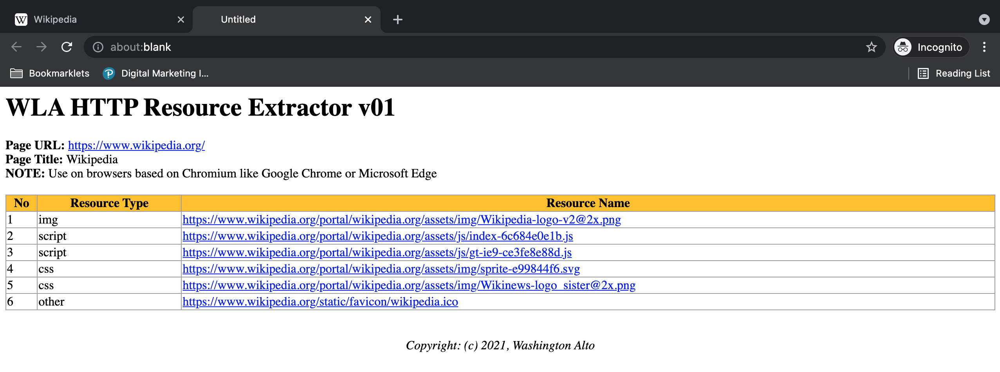

### WLA HTTP Resource Extractor bookmarklet

  * Usage 

    To list down HTTP resources calls just like Google Chrome developer tool network calls. This works on browsers based on Chromium 
    
  * Code  

    ```
    javascript:function listQueryParameters(urlString){function queryparamToObject(prmstr){var params={};if(!prmstr)return params;let prmarr=prmstr.indexOf("&")?prmstr.split("&"):prmstr;for(let i=0;i<prmarr.length;i++){let tmparr=prmarr[i].split("=");params[tmparr[0]]=tmparr[1]}return params}queryObj=urlString.indexOf("?")?queryparamToObject(urlString.split("?")[1]):{};let strOutput="";if(0===Object.keys(queryObj).length)strOutput+="";else{strOutput="<DIV>",strOutput="<BR><BR><SPAN class='propertyname'>Query Parameters:</SPAN>",strOutput+="<UL>";for(const item in queryObj)strOutput+="<LI><SPAN class='propertyname'>"+item+"</SPAN>: "+decodeURIComponent(queryObj[item])+"</LI>";strOutput+="</UL></DIV>"}return strOutput}function isValidHttpUrl(strTest){let url;try{url=new URL(strTest)}catch(_){return!1}return"http:"===url.protocol||"https:"===url.protocol}function formatHTMLcellvalues(strCellinput){let tagsToReplace={"&":"&amp;","<":"&lt;",">":"&gt;"},strOutput;function replaceTag(tag){return tagsToReplace[tag]||tag}function safe_tags_replace(str){return str.replace(/[&<>]/g,replaceTag)}return strOutput=isValidHttpUrl(strCellinput)?"<A HREF='"+strCellinput+"' target='_blank'>"+decodeURIComponent(strCellinput)+"</A>"+listQueryParameters(strCellinput):null==strCellinput||0==String(strCellinput).trim().length?"":safe_tags_replace(String(strCellinput).trim()),strOutput}function setTableStyle(){let strOutput="<STYLE>";return strOutput+="table { width: 100%;  }",strOutput+="table,th,td { border:1px solid #9E9E9E; border-collapse: collapse  }",strOutput+="th { background: #FFC107; }",strOutput+=".propertyname { font-weight:bold; font-color:blue; }",strOutput+="</STYLE>",strOutput}function formatPageHeaders(strHeader,strNotes=""){let strOutput="<H1>"+strHeader+"</H1>";return strOutput+="<STRONG>Page URL: </STRONG>",strOutput+="<A href='"+location.href+"' target='_blank'>"+location.href+"</A><BR>",strOutput+="<STRONG>Page Title: </STRONG>",strOutput+=document.title+"<BR>",strOutput+=""!=strNotes?"<STRONG>NOTE: </STRONG>"+strNotes+"<BR><BR>":"",strOutput}function formatHTMLTableHeaders(){let strOutput="<TABLE>";strOutput+="<TR>";for(let i=0;i<arguments.length;i++)strOutput+="<TH>"+arguments[i]+"</TH>";return strOutput+="</TR>",strOutput}function formatHTMLTableRows(){let strOutput="<TR>";for(let i=0;i<arguments.length;i++)strOutput+="<TD>"+formatHTMLcellvalues(arguments[i])+"</TD>";return strOutput+="</TR>",strOutput}!function(){let pageH1="WLA HTTP Resource Extractor v01",pageNotes="Use on browsers based on Chromium like Google Chrome or Microsoft Edge",objCollection=performance.getEntriesByType("resource"),pageHost=location.host,strHTMLlines="";strHTMLlines+=setTableStyle(),strHTMLlines+=formatPageHeaders(pageH1,pageNotes),strHTMLlines+="<div style='overflow-x:auto;'>",strHTMLlines+=formatHTMLTableHeaders("No","Resource Type","Resource Name");for(let i=0;i<objCollection.length;i++){let objItem=objCollection[i];strHTMLlines+=formatHTMLTableRows(i+1,objItem.initiatorType,objItem.name)}strHTMLlines+="</TABLE>",strHTMLlines+="</DIV>",strHTMLlines+="<BR><BR><DIV style='text-align: center;'><CITE>Copyright: (c) 2021, Washington Alto</CITE></DIV>";let myWin=window.open();myWin.document.writeln(strHTMLlines),myWin.document.close()}();
    ```
  * Screenshot  

    
      
    <p align=center>Image of Wikipedia page</p>

    

    <p align=center>Image of Wikipedia WLA HTTP Resource Extractor result</p>
