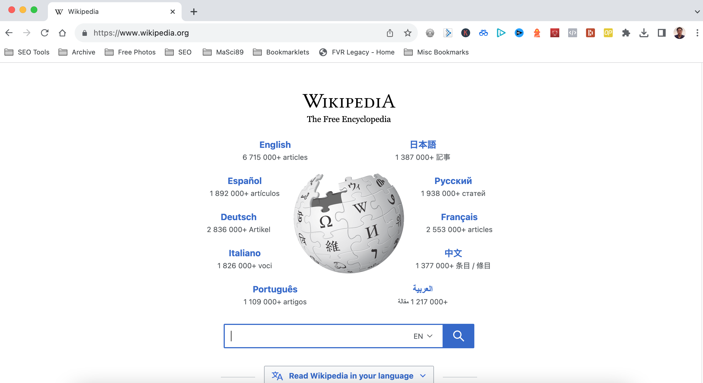
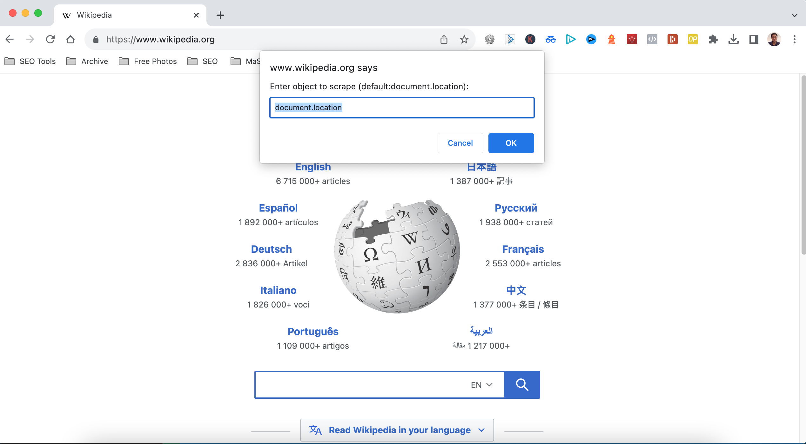

### WLA Object to JSON scraper bookmarklet

  * Usage 

    To list down the properties of user-selected object with the option for user to download as JSON file
    
  * Code  

    ```
    javascript:(function(){if("undefined"==typeof Obj_to_JSON&&"undefined"==typeof PageProperty){class Obj_to_JSON{strHTMLlines="";objJSON="";static setDivStyle(t,e){let o="<STYLE>";return o+=".propertyname { font-weight:bold; font-color:"+e+"; }.outputarea { background-color: "+t+"; } ",o+="</STYLE>",o}constructor(inputObjname){this.inputObj=eval(inputObjname),this.inputObjname=inputObjname}static recursiveObjformat(t){let e="<DIV class='outputarea'>";e+="<UL>";for(let o in t){if(!t.hasOwnProperty(o))continue;const r=t[o];if(e+=`<LI><SPAN class='propertyname'>${o}</SPAN>: `,null==r)e+="(null)";else if("function"==typeof r)e+=r.toString();else if(Array.isArray(r)){e+="<OL>";for(let t of r)e+="<LI>",e+=t&&"object"==typeof t?this.recursiveObjformat(t):t,e+="</LI>";e+="</OL>"}else e+="object"==typeof r?this.recursiveObjformat(r):r;e+="</LI>"}return e+="</UL></DIV>",e}display(t="lightblue",e="blue"){let o=this.inputObj,r="<STRONG>Ojbect selected</STRONG>: "+this.inputObjname;r+=Obj_to_JSON.setDivStyle(t,e),r+=Obj_to_JSON.recursiveObjformat(o);let n=Obj_to_JSON.createobjJSON(this);return r+=Obj_to_JSON.createJSONBloblink(n),r}static createobjJSON(t){return JSON.stringify(t.inputObj)}static createJSONBloblink(t,e="download.json"){let o=new Blob([t],{type:"text/json"});return'<A href="'+window.URL.createObjectURL(o)+'" download="'+e+'">Download as JSON</A><BR><BR>'}}class PageProperty{pageTitle="";objProperty={};constructor(t,e=""){this.pageTitle=e,this.objProperty=t}displayPageHeaders(){let t=this.pageTitle,e="<TITLE>"+t+"</TITLE>";e+="<H1>"+t+"</H1>";for(let t in this.objProperty)e+="<STRONG>"+t+"</STRONG>: ",e+=PageProperty.formatObjvalues(this.objProperty[t])+"<BR>";return e+="<BR>",e}displayPageFooters(){return"<BR><BR><DIV style='text-align: center;'><CITE>Copyright: (c) 2021, Washington Alto</CITE></DIV>"}static isValidHttpUrl(t){let e;try{e=new URL(t)}catch(t){return!1}return"http:"===e.protocol||"https:"===e.protocol}static formatObjvalues(t){let e,o={"&":"&amp;","<":"&lt;",">":"&gt;"};function r(t){return o[t]||t}return e=PageProperty.isValidHttpUrl(t)?"<A HREF='"+t+"' target='_blank'>"+decodeURIComponent(t)+"</A>":null==t||0==String(t).trim().length?"":String(t).trim().replace(/[&<>]/g,r),e}}function validate_object(objString){return"object"==typeof eval(objString)}var objtoscrape=prompt("Enter object to scrape (default:document.location): ","document.location");propDict={"Page URL":location.href,"Page Name":document.title};let propPage=new PageProperty(propDict,pageTitle="WLA Object to JSON scraper v02"),strHTMLlines="";strHTMLlines+=propPage.displayPageHeaders();let customObj={};validate_object(objtoscrape)?(customObj=new Obj_to_JSON(objtoscrape),strHTMLlines+=customObj.display()):strHTMLlines+="Invalid object selected: "+objtoscrape,strHTMLlines+=propPage.displayPageFooters();let myWin=window.open();myWin.document.writeln(strHTMLlines),myWin.document.close()}})();
    ```
  * Screenshot  

    
      
    <p align=center>Image of Wikipedia page</p>

    

    

    <p align=center>Image of Object to JSON scraper result</p>
