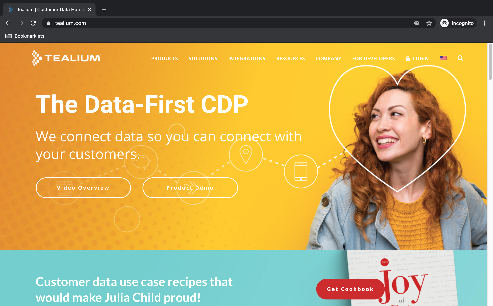
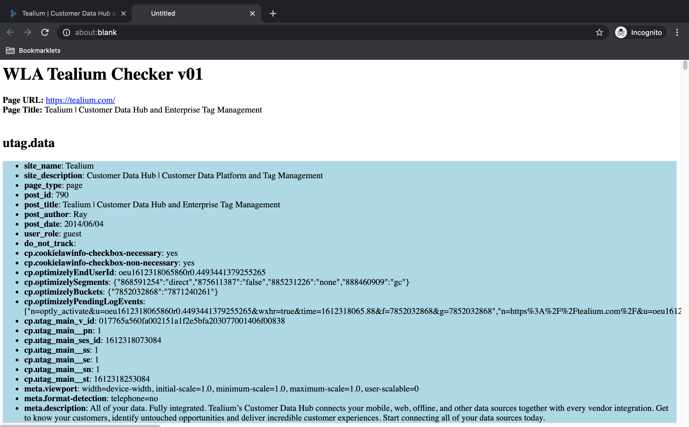

### WLA Tealium Checker bookmarklet

  * Usage 

    To list down some Tealium UDO variable values as well as information from relevant Tealium objects. Note that this will only work on pages that uses Tealium. 
    
  * Code  

    ```
    javascript:class Obj_to_JSON{strHTMLlines="";objJSON="";static setDivStyle(divBackgroundcolor,divPropertycolor){let strOutput="<STYLE>";return strOutput+=".propertyname { font-weight:bold; font-color:"+divPropertycolor+"; }.outputarea { background-color: "+divBackgroundcolor+"; } ",strOutput+="</STYLE>",strOutput}constructor(inputObjname){this.inputObj=eval(inputObjname),this.inputObjname=inputObjname}static recursiveObjformat(obj){let strOutput="<DIV class='outputarea'>";strOutput+="<UL>";for(let property in obj)if(obj.hasOwnProperty(property)&&null==obj[property])strOutput+="<LI><SPAN class='propertyname'>"+property+"</SPAN>: (null)</LI>";else if(!obj.hasOwnProperty(property)||obj[property].constructor!=String&&obj[property].constructor!=Number&&obj[property].constructor!=Boolean)if(obj.hasOwnProperty(property)&&obj[property].constructor==Array){strOutput+="<LI><SPAN class='propertyname'>"+property+"</SPAN>: <OL>";for(let i=0;i<obj[property].length;i++)strOutput+="<LI>"+obj[property][i]+"</LI>";strOutput+="</OL></LI>"}else obj.hasOwnProperty(property)&&obj[property].constructor==Object?(strOutput+="<LI><SPAN class='propertyname'>"+property+"</SPAN>: ",strOutput+=Obj_to_JSON.recursiveObjformat(obj[property]),strOutput+="</LI>"):obj.hasOwnProperty(property)&&obj[property].constructor==Function&&(strOutput+="<LI><SPAN class='propertyname'>"+property+"</SPAN>: ",strOutput+=obj[property],strOutput+="</LI>");else strOutput+="<LI><SPAN class='propertyname'>"+property+"</SPAN>: "+obj[property]+"</LI>";return strOutput+="</UL></DIV>",strOutput}display(divBackgroundcolor="lightblue",divPropertycolor="blue"){let obj=this.inputObj,strOutput="<STRONG>"+this.inputObjname+"</STRONG>";strOutput+=Obj_to_JSON.setDivStyle(divBackgroundcolor,divPropertycolor),strOutput+=Obj_to_JSON.recursiveObjformat(obj);let strJSON=Obj_to_JSON.createobjJSON(this);return strOutput+=Obj_to_JSON.createJSONBloblink(strJSON),strOutput}static createobjJSON(thisObj){return JSON.stringify(thisObj.inputObj)}static createJSONBloblink(objJSON,jsonFileName="download.json"){let linkText="Download as JSON",objJSONBlob=new Blob([objJSON],{type:"text/json"}),jsonURL,HTMLlink;return'<A href="'+window.URL.createObjectURL(objJSONBlob)+'" download="'+jsonFileName+'">'+linkText+"</A><BR><BR>"}}class PageProperty{pageTitle="";objProperty={};constructor(objProperty,pageTitle=""){this.pageTitle=pageTitle,this.objProperty=objProperty}displayPageHeaders(){let strHeader=this.pageTitle,strOutput="<TITLE>"+strHeader+"</TITLE>";strOutput+="<H1>"+strHeader+"</H1>";for(let key in this.objProperty)strOutput+="<STRONG>"+key+"</STRONG>: ",strOutput+=PageProperty.formatObjvalues(this.objProperty[key])+"<BR>";return strOutput+="<BR>",strOutput}displayPageFooters(){let strFooter;return"<BR><BR><DIV style='text-align: center;'><CITE>Copyright: (c) 2021, Washington Alto</CITE></DIV>"}static isValidHttpUrl(strTest){let url;try{url=new URL(strTest)}catch(_){return!1}return"http:"===url.protocol||"https:"===url.protocol}static formatObjvalues(strCellinput){let tagsToReplace={"&":"&amp;","<":"&lt;",">":"&gt;"},strOutput;function replaceTag(tag){return tagsToReplace[tag]||tag}function safe_tags_replace(str){return str.replace(/[&<>]/g,replaceTag)}return strOutput=PageProperty.isValidHttpUrl(strCellinput)?"<A HREF='"+strCellinput+"' target='_blank'>"+decodeURIComponent(strCellinput)+"</A>":null==strCellinput||0==String(strCellinput).trim().length?"":safe_tags_replace(String(strCellinput).trim()),strOutput}}!function(){propDict={"Page URL":location.href,"Page Name":document.title};let propPage=new PageProperty(propDict,pageTitle="WLA Tealium Checker v03"),strHTMLlines="";strHTMLlines+=propPage.displayPageHeaders();let customObj={};customObj=new Obj_to_JSON("utag.data"),strHTMLlines+=customObj.display(),customObj=new Obj_to_JSON("utag.rpt"),strHTMLlines+=customObj.display(),customObj=new Obj_to_JSON("utag.cfg"),strHTMLlines+=customObj.display(),customObj=new Obj_to_JSON("utag.send"),strHTMLlines+=customObj.display(),customObj=new Obj_to_JSON("utag.sender"),strHTMLlines+=customObj.display(),utag.gdpr&&(utag.gdpr.consent_prompt&&(customObj=new Obj_to_JSON("utag.gdpr.consent_prompt"),strHTMLlines+=customObj.display()),utag.gdpr.preferences_prompt&&(customObj=new Obj_to_JSON("utag.gdpr.preferences_prompt"),strHTMLlines+=customObj.display()),customObj=new Obj_to_JSON("utag.gdpr.values"),strHTMLlines+=customObj.display()),strHTMLlines+=propPage.displayPageFooters();let myWin=window.open();myWin.document.writeln(strHTMLlines),myWin.document.close()}();
    ```
  * Screenshot  

    
      
    <p align=center>Image of Tealium page</p>

    

    <p align=center>Image of Wikipedia WLA Tealium Checker result</p>
