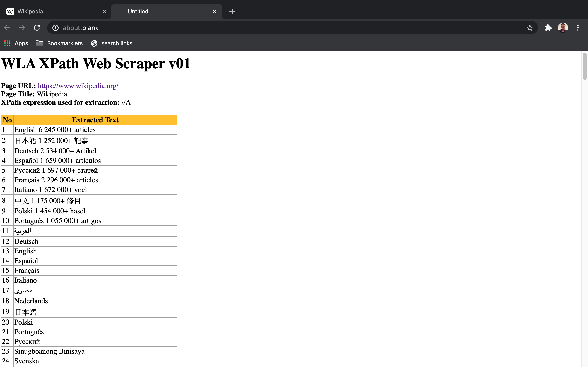

### WLA XPath Web Scraper bookmarklet

  * Usage 

    To list down results of web scrape XPath query in tabular form. The result includes only extracted text.
    
  * Code  

    ```
    javascript:function isValidHttpUrl(strTest){let url;try{url=new URL(strTest)}catch(_){return!1}return"http:"===url.protocol||"https:"===url.protocol}function formatHTMLcellvalues(strCellinput){let tagsToReplace={"&":"&amp;","<":"&lt;",">":"&gt;"},strOutput;function replaceTag(tag){return tagsToReplace[tag]||tag}function safe_tags_replace(str){return str.replace(/[&<>]/g,replaceTag)}return strOutput=isValidHttpUrl(strCellinput)?"<A HREF='"+strCellinput+"' target='_blank'>"+decodeURIComponent(strCellinput)+"</A>":null==strCellinput||0==String(strCellinput).trim().length?"":safe_tags_replace(String(strCellinput).trim()),strOutput}function setTableStyle(){let strOutput="<STYLE>";return strOutput+="table,th,td { border:1px solid #9E9E9E; border-collapse: collapse  }",strOutput+="th { background: #FFC107; }",strOutput+="</STYLE>",strOutput}function formatPageHeaders(strHeader,strNotes="",strXPath=""){let strOutput="<H1>"+strHeader+"</H1>";return strOutput+="<STRONG>Page URL: </STRONG>",strOutput+="<A href='"+location.href+"' target='_blank'>"+location.href+"</A><BR>",strOutput+="<STRONG>Page Title: </STRONG>",strOutput+=document.title+"<BR>",strOutput+="<STRONG>XPath expression used for extraction: </STRONG>",strOutput+=strXPath+"<BR><BR>",strOutput+=""!=strNotes?"<STRONG>NOTE: </STRONG>"+strNotes+"<BR><BR>":"",strOutput}function formatHTMLTableHeaders(){let strOutput="<TABLE>";strOutput+="<TR>";for(let i=0;i<arguments.length;i++)strOutput+="<TH>"+arguments[i]+"</TH>";return strOutput+="</TR>",strOutput}function formatHTMLTableRows(){let strOutput="<TR>";for(let i=0;i<arguments.length;i++)strOutput+="<TD>"+formatHTMLcellvalues(arguments[i])+"</TD>";return strOutput+="</TR>",strOutput}!function(){const xPathwebscrape=prompt("Enter XPath expression for web scraping (default://A): ","//A");let pageH1="WLA XPath Web Scraper v01",pageNotes="",objCollection=document.evaluate(xPathwebscrape,document,null,XPathResult.ANY_TYPE,null),pageHost=location.host,strHTMLlines="";strHTMLlines+=setTableStyle(),strHTMLlines+=formatPageHeaders(pageH1,"",xPathwebscrape),strHTMLlines+=formatHTMLTableHeaders("No","Extracted Text");let i=1,thisobjItem=objCollection.iterateNext();for(;thisobjItem;)strHTMLlines+=formatHTMLTableRows(i,thisobjItem.textContent),i++,thisobjItem=objCollection.iterateNext();strHTMLlines+="</TABLE>",strHTMLlines+="<BR><BR><DIV style='text-align: center;'><CITE>Copyright: (c) 2021, Washington Alto</CITE></DIV>";let myWin=window.open();myWin.document.writeln(strHTMLlines),myWin.document.close()}();
    ```
  * Screenshot  

    
      
    <p align=center>Image of Wikipedia page</p>

    

    <p align=center>Image of Wikipedia WLA XPath Extractor result</p>
